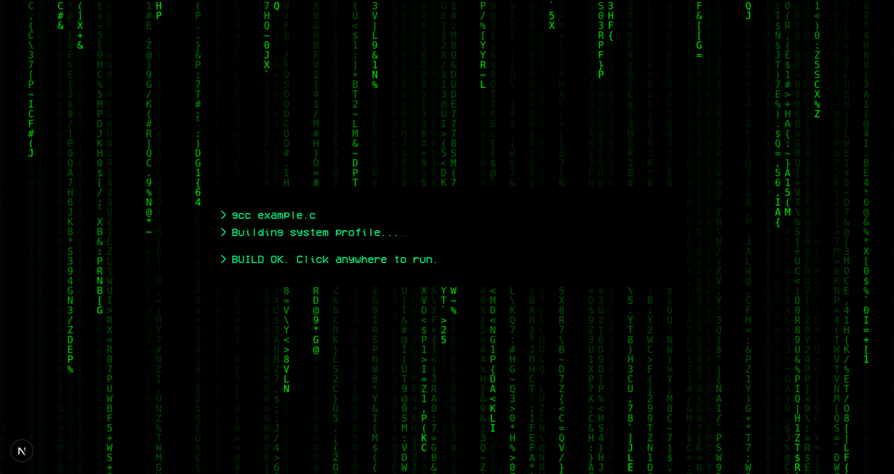

#  Matrix Portflio




<p align="center">
  
  
  
</p>

This is a portfolio website built with [Next.js](https://github.com/vercel/next.js) and designed with [v0.dev](https://v0.dev)

I did it for educational purposes and you can copy it and tweak!

**Also it has latest TailwindCSS (v4 in current time) so don't need to worry about the drama of Tailwind and shadcn. I gave 4 hours just to fix broken packages. I hope a llama chases the Tailwind developers while they're thirsty and hungry in the middle of the Sahara Desert after v4 change.**

---

## 🛠️ Setup

#### Step 1: Clone the repository from Git
```bash
git clone https://github.com/atailh4n/matrix-portfolio
cd matrix-portfolio
```

#### Step 2: Install the necessary packages
```bash
npm i
```

---

### You are ready to go! Now, start the project with:
```bash
npm run build
npm run start
```
### or, run at debug mode
```bash
npm run dev
```

---

## License

This project is licensed under the MIT License.
You can read details at [here](LICENSE) 
Made with 💙 by Ata İlhan Köktürk.

---

## Contribution

Feel free to open issues or contribute to the project!

---

## Contact

You can find me and my socials here: [Click here to visit my profile](https://github.com/atailh4n).